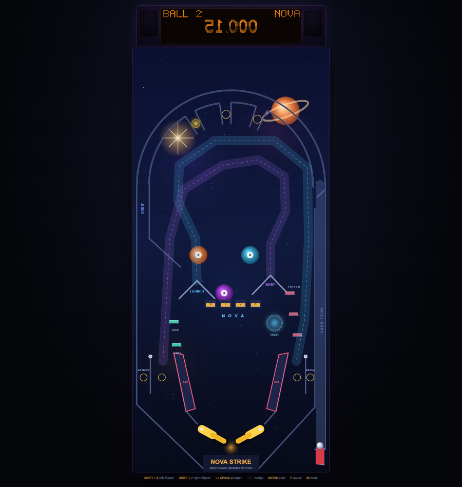

# NOVA STRIKE — Deep Space Defense System

A Williams-style solid-state pinball machine in the browser. Zero dependencies,
no build step — plain ES modules, a custom impulse-based physics engine, a
dot-matrix display, and synthesized WebAudio sound.



## Run it

```sh
node serve.js        # or: npm start
# open http://localhost:8080/
```

Any static file server works (the game is plain HTML/JS/CSS).

## Controls

| Key | Action |
|---|---|
| **Left Shift** / **Z** | Left flipper |
| **Right Shift** / **/** | Right flipper |
| **Down** / **Space** (hold) | Charge plunger, release to launch |
| **Left / Right / Up arrows** | Nudge (beware TILT) |
| **Enter** | Start game / lock in high-score letter |
| **P** | Pause |
| **M** | Mute |

## Rules

- **Skill shot** — plunge into the flashing top lane (lit lane rotates when you flip).
- **Top lanes N-O-V...** — complete all three arch lanes to advance the **bonus multiplier** (up to 10X).
- **NOVA drop bank** — clear all four drops for 50K and a multiplier step. Every second bank lights **EXTRA BALL** at the Dock.
- **LOCK targets** (left, teal) — hit both to light the lock. Lock 2 balls at the **Dock** saucer; the third trip starts **ARMADA MULTIBALL** (3 balls, ramp jackpots, 15 s ball save).
- **Missions** — with the lock unlit, the Dock starts a timed mission: *Asteroid Storm* (pop bumpers), *Rampage* (ramps), *Gunnery Drill* (targets). Finish all three to light **NOVA STRIKE** wizard mode at the Dock (45 s of double scoring).
- **Combos** — alternate LAUNCH and WARP ramps within 4 s to build a x2..x5 combo.
- **Kickback** — lit on ball 1 and relit via the left inlane; saves left-outlane drains.
- **Ball save** — first seconds of every ball (and of multiball).
- **Tilt** — three solid nudges in a row and the ball is dead. Two warnings first.
- **Match** — end-of-game match awards a free game.
- **High scores** — top 5 with classic three-initial entry, persisted in `localStorage`.

## Tech notes

- `js/physics.js` — fixed-timestep (480 Hz substep) circle vs. segment/arc/circle
  collision, rotating-capsule flippers with angular-velocity impulse transfer,
  ball-ball collision, scripted ramp paths. No DOM; runs in Node.
- `js/table.js` — the playfield: orbit arch with drop-through top lanes, one-way
  shooter-lane gate, 3 pop bumpers, 2 slingshots, 2 ramps, 4-bank drop targets,
  5 standups, saucer, kickback, plunger lane.
- `js/rules.js` — full game state machine (also DOM-free).
- `js/dmd.js`, `js/art.js`, `js/audio.js` — dot-matrix display, canvas playfield
  art, synthesized SFX/music.

## Tests

```sh
npm test              # physics/rules scenarios + two 2-minute random-play soaks
node test/sim.js soak 300   # 5-minute soak
```

The headless rig plays full games with a deterministic PRNG and asserts: no
tunneling/escapes, no permanently stuck balls, plunges orbit, weak plunges fall
back, flippers impart energy, locks start multiball, ramps score, missions and
wizard mode complete, tilt engages.
