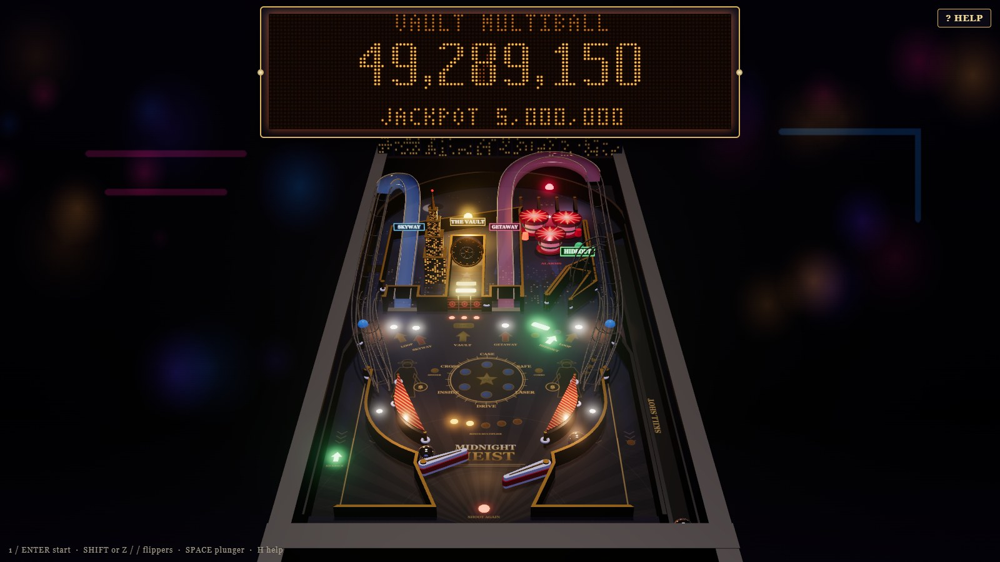

# MIDNIGHT HEIST

*One night. One vault. No second chances.*



A Williams/WPC-style pinball machine for the browser, built from scratch: a
3D art-deco noir table rendered with Three.js, a rigid-body physics engine
modeled in real inches on a standard 20.25" × 45" playfield, a 128×32
dot-matrix display, a full rule set with multiball, six modes and a wizard
mode, synthesized sound and music, and a persistent high-score table.

## Play

Open `index.html` in a modern desktop browser (Chrome, Edge, Firefox or Safari).
No server or install needed. The prebuilt bundle is in `dist/`.

| Key | Action |
| --- | --- |
| Left Shift · Z · ← | Left flipper |
| Right Shift · / · → | Right flipper |
| Space · Enter · ↓ | Plunger: hold to pull, release to launch. The gauge's green band is the soft skill-shot zone |
| 1 · S | Start game; press again during ball 1 to add players (up to 4) |
| Q · W · E | Nudge left / up / right (watch the tilt warnings) |
| V | Camera: player · overhead · cinematic |
| G | Graphics quality: high · medium · low (quality also drops automatically if the frame rate stalls) |
| P · Esc | Pause |
| M | Music off → all sound off → sound on |
| F · H | Fullscreen · help card |

On touch screens, tap the left or right half to flip, the bottom-right corner for
the plunger, and the top of the screen to start.

## The rules

- **Skill shot**: a soft plunge crests the arch and drops into the **K-E-Y** lanes.
  Hitting the flashing lane scores 1M (+0.5M each time); the flipper buttons move
  the lit lane. A **full plunge** loops the orbit; make the **GETAWAY** (right)
  ramp within 6 seconds for a **super skill shot** worth 3M+.
- **K-E-Y lanes** advance the bonus multiplier (up to 6X) and relight the kickback.
  The flipper buttons rotate lit lanes (lane change).
- **Alarms (pop bumpers)**: every 20 hits raises the alarm level and the pop value.
- **Laser grid → vault**: knock down the three laser drop targets, crack the vault
  door (the number of door hits needed rises with each lock), then shoot the open
  vault to **lock a ball**. The third lock starts **VAULT MULTIBALL** (3 balls, 15 s ball save).
- **Multiball**: loops and ramps are lit for **jackpots** (5M, +1M each). Collect
  all four to open the vault for the **super jackpot** (20M+). The hideout adds a
  ball once per multiball.
- **Jobs (modes)**: three loops light **START JOB** at the hideout. The scoop holds
  the ball while you pick a job with the flippers:
  Case the Joint · Crack the Safe · Laser Maze · Getaway Drive · Inside Man (vault hurry-up) · Double Cross (moving shot).
- **THE BIG SCORE**: play all six jobs to light the 4-ball wizard mode. Loops and
  ramps score 10M each; then the vault is worth 100M, and the level repeats higher.
- **Extra ball**: lit by 12 ramps, 3 completed jobs or the first multiball; collect at the hideout.
- **Also**: loop/ramp combos, spinner (lit by the GETAWAY ramp), two ALIBI standups
  (relight kickback / light spinner), mystery awards at the hideout, a left-outlane
  kickback, a 10-second ball save, tilt with two warnings, end-of-ball bonus, match,
  replay at 150M, and a five-entry high-score table (Grand Champion + 4) saved in
  the browser's local storage.

## Realism notes

- Playfield 20.25" × 45" at a 6.5° pitch, with a 1-1/16" steel ball (gravity along
  the playfield is 5/7 · g · sin 6.5° ≈ 31 in/s² for a rolling ball).
- 3" flippers with pivots 6.8" apart, a 27° rest angle and 52° of stroke. The coil
  snaps the bat up in about 20 ms. The exit angle follows a flipper "polarity" curve
  (the kind VPX tables use) fitted to real-machine behavior: early, near-base hits
  cross the table and late tip hits go backhand.
- Speed-dependent restitution for rubber, wood, metal and flippers; dead soft contacts
  let the ball settle into cradles and roll off the inlane onto the bat.
- Slingshots and pop bumpers are active kickers (~3 m/s). Ramps and wireforms are 3D
  splines with the ball's speed integrated along the slope, so weak ramp shots roll back.
- Physics runs at a fixed 2 kHz sub-step, independent of frame rate.

## Architecture

```
src/
  sim/physics.js      rigid-body engine: segments/arcs/circles, tapered flippers, paths, spinner, plunger
  table/layout.js     the table design in inches, the single source for physics AND rendering
  table/build.js      builds the physics world (colliders, triggers, ramps) from the layout
  game/machine.js     "driver board": trough, shooter, drop targets, vault door, scoops, kickback, tilt bob, ball search
  game/rules.js       "game ROM": scoring, skill shots, locks, multiball, jobs, wizard, bonus, match, high scores, lamps
  display/            128×32 DMD: bitmap fonts, frame buffer, scene queue, procedural animations, glowing-dot renderer
  render/scene3d.js   Three.js table: extruded walls, ramps, wireforms, toys, inserts, bloom, cube-mapped chrome ball
  render/art.js       procedurally painted playfield artwork
  audio/sound.js      WebAudio synthesis: mechanical sounds, scoring sounds, sequenced noir-jazz/spy soundtrack
  main.js             input, pause, camera/quality toggles, frame loop
```

The physics, machine and rules have no DOM dependency and run headless in Node.

## Develop

```sh
npm install
npm run build     # bundles src/ into dist/midnight-heist.js
npm test          # physics regressions, rule scenarios, full autoplayed games
```

- `test/physics.test.mjs`: plunge outcomes, orbit returns, inlane feed, cradling,
  shot reachability from both flippers, high-speed containment, and a 20-minute stuck-ball soak.
- `test/rules.test.mjs`: scripted scenarios for every rule path.
- `test/headless.mjs`: an autoplayer plays complete 1- and 2-player games,
  checking ball accounting and that every game ends.
- `tools/`: layout and trajectory visualizers (`dumpgeom.mjs` + `draw.py`, `trace.mjs`,
  `anglemap.mjs`, `cradlemap.mjs`, `plungecal.mjs`) used to tune the geometry.
