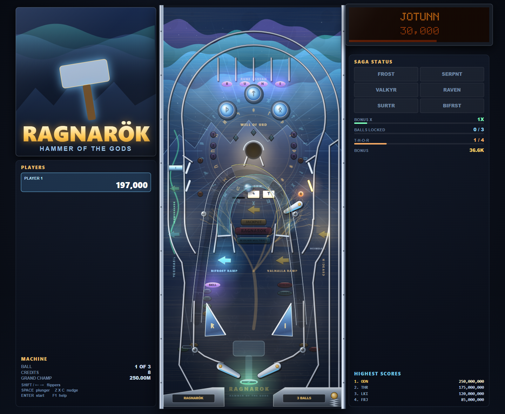

# RAGNARÖK — Hammer of the Gods

A browser pinball machine built to the proportions, physics and rule depth of a
Williams solid‑state table. No engine, no frameworks, no asset files — the
playfield art, the 128×32 dot‑matrix display and every sound are generated at
runtime from code.



---

## Play it

**Easiest:** double‑click `start.bat` (Windows). It starts a tiny local server
if Node is present and opens the game in your browser.

**Or:**

```
node serve.js 8080      →  http://localhost:8080
```

**Or** just open `index.html` directly — the game uses classic scripts rather
than ES modules, so `file://` works too (high scores fall back to memory in
browsers that block `localStorage` on `file://`).

Click **INSERT COIN**, then press **ENTER** to start.

---

## Controls

| Action | Keys |
|---|---|
| Left flipper *(and the upper Heimdall flipper is on the right button)* | **Left Shift**, **←**, or **A** |
| Right flipper | **Right Shift**, **→**, or **L** |
| Plunger — *hold to pull back, release to launch* | **Space** or **↓** |
| Nudge left / forward / right | **Z** / **X** (or **↑**) / **C** |
| Start game *(press again during ball 1 to add a player, up to 4)* | **Enter** or **1** |
| Insert coin | **5** |
| Pause | **Esc** or **P** |
| High scores | **H** |
| Mute | **M** |
| Fullscreen | **F** |
| Help / controls | **F1** |
| Ball speed slower / faster *(saved between games)* | **[** / **]** |
| Physics debug overlay | **F3** |

Nudging too hard trips the plumb bob: two warnings, then **TILT** and you
forfeit the ball and its bonus.

Before you launch, tap the flipper buttons to **choose your skill shot** — the
flashing arrow is what you have to hit first.

---

## The table

```
                ╭──────── TOP ARCH ORBIT ────────╮
              ╱      R   U   N   E  top lanes      ╲
   YGGDRASIL │        ◉    ◉    ◉  pop bumpers      │ MIDGARD
   left orbit│                                      │ right orbit
   ⌾ spinner │   ◈ locks    ◯ WELL OF URD    ◈      │
   T,H  ▮    │   ①②③                      ④⑤⑥      │    ▮ O,R
             │        ▬▬▬ JÖTUNN 3-bank ▬▬▬         │  ⟋ Heimdall
             │    ╱  BIFRÖST        VALHALLA  ╲     │     flipper
             │   ╱     ramp            ramp    ╲    │
              ╲        ◤ sling      sling ◥        ╱
        outlane │ inlane                inlane │ outlane
                     ╲___╱            ╲___╱
                    [ L FLIPPER ]  [ R FLIPPER ]
                            ╲  DRAIN  ╱
```

**Six shots, three flippers.** Left ramp (Bifröst) returns to the right
inlane, right ramp (Valhalla) to the left inlane, and they cross over each
other. Both orbits run the full arch — loop one and it comes back down the
other side.

### Rules

**Jötunn → the Well of Urd.** Knock down the three drop targets to open the
vault. What the vault gives you depends on what's lit, in this order:

1. **Ragnarök** (if all six sagas are done)
2. **Super jackpot / jackpot** (during multiball)
3. **Extra ball** (if lit)
4. **Ball lock** (if the lock is lit)
5. **Start the next saga**
6. …otherwise, points.

**The six sagas.** Each is a timed mode with its own shots and its own DMD
animation. Finish one and it stays green on the status board.

| Saga | Objective |
|---|---|
| FROST GIANTS | Smash the Jötunn targets, 7 of them |
| SERPENT HUNT | Spinner and both orbits |
| VALKYRIE FLIGHT | Ramps only, escalating |
| RAVEN'S EYE | Hurry‑up — the value bleeds away, collect it at the vault |
| FIRE OF SURTR | Pop bumpers and T‑H‑O‑R targets |
| BIFRÖST RUN | Follow the lit shot through a five‑shot sequence |

**Mjölnir Multiball.** Drop the Jötunn bank to light the lock, shoot the
vault, repeat three times. Three balls, jackpots on the ramps and orbits, and
after four jackpots the **super jackpot** lights at the vault.

**Ragnarök.** Complete all six sagas, then shoot the vault. Four balls, every
shot lit, 75 seconds. Clear all six shots for the 30 million.

**Everything else, as you'd expect from the era:** R‑U‑N‑E top lanes build the
bonus multiplier to 10×; T‑H‑O‑R standups light the left‑outlane kickback and
then an extra ball and a special; combos multiply consecutive shots; a ball
saver runs at the start of every ball and every multiball; end‑of‑ball bonus
counts up on the DMD; a replay at 45 million bangs the knocker; and the game
finishes with a **match** for a free credit.

High scores keep a Grand Champion, a top‑four table, and four category
champions (loops, jackpots, ramps, spins) in `localStorage`.

---

## The simulation

Everything is in real units — **millimetres, grams, seconds** — against a
Williams WPC playfield.

| | |
|---|---|
| Playfield | 521 × 1168 mm (20.5″ × 46″) |
| Ball | 27 mm ⌀, 80 g steel |
| Playfield pitch | 6.5° → 1110 mm/s² down‑slope, 9747 mm/s² into the surface |
| Flipper | 3″ bat, ~50° sweep in ~27 ms, tip ≈ 3.0 m/s |
| Flipper rubber | elasticity 0.88, falloff 0.15, friction 0.9 (VP late‑era Williams) |
| Integration | fixed 960 Hz substep (16 per 60 Hz frame) |

At 960 Hz a 6 m/s ball travels 6.3 mm per step — comfortably under the 13.5 mm
ball radius, so nothing can tunnel a wall.

**Ball speed.** A real cabinet is played at arm's length over a 1.17 m
playfield; on a monitor the same trajectories read a lot faster, so the
simulation runs at **70% of real time** by default. This scales time only —
every trajectory, shot angle, ramp threshold and flipper relationship is
bit-identical to true 6.5° pitch, just played back slower. **[** and **]**
adjust it live between 55% and 115%, and the setting is remembered.

Contacts resolve as proper impulses: normal restitution with a speed‑dependent
falloff, Coulomb friction coupled to ball spin (solid sphere, `1/m + r²/I =
3.5/m`), and a little manufacturing scatter on rubber so no two hits off a post
are identical. Balls collide with each other during multiball. Cradling,
live catches, post passes and drop catches all fall out of the model rather
than being special‑cased.

Ramps aren't fake. A ball that commits to one rides an arc‑length‑parametrised
spline with a real height profile, and gravity resolves into the path tangent —
so an under‑hit shot stalls partway up and **rolls back out of the flap**. The
left ramp needs about 1.5 m/s at the entrance, the right about 1.8 m/s.

The orbit lanes turn a 55° flipper shot into a vertical lane through a true
tangent arc rather than a chain of straight segments. That detail matters more
than it sounds: on a polyline the ball rattles wall‑to‑wall and arrives at the
top with a fifth of its speed.

---

## Testing

The table is verified headlessly rather than by eye.

```
node test/sim.js          # physics + geometry, no browser needed
node test/scenarios.js    # every rule path: modes, multiball, wizard, tilt, bonus, high scores
node test/soak.js 60      # 60 s of bot autoplay in real Chrome
node test/shot.js name --play    # screenshot to test/shots/
```

`test/sim.js` loads `util/physics/table` into a bare V8 context and answers the
questions screenshots can't:

* does a plunged ball make it round the arch at every plunger strength?
* is each shot reachable from each flipper, and at what angles?
* can a ball get stuck, escape the cabinet, or tunnel a wall? *(270 balls
  dropped across the playfield with random velocities — currently 0 stuck,
  0 escaped)*
* do the ramps reject a weak shot and accept a strong one?

The browser tests need Chrome; set `CHROME_PATH` if it isn't at the default
Windows location. `npm install` first — the only dependency is
`puppeteer-core`, and it's test‑only. The game itself has zero dependencies.

---

## Layout

```
index.html          styles.css        serve.js       start.bat
src/
  util.js           maths, RNG, colour, storage
  physics.js        world, colliders, contacts, flippers, ramp solver
  table.js          the RAGNARÖK playfield: every wall, mech and trigger
  art.js            bakes the screen‑printed playfield + insert lenses
  render.js         cabinet, lighting, ramps, ball, side panels
  dmdfont.js        hand‑authored 5×7 and 13‑tall bitmap fonts
  dmd.js            128×32 plasma display with 16 intensity levels
  rules.js          scoring, sagas, multiball, wizard, bonus, tilt
  highscore.js      champion tables + initials entry
  audio.js          synthesised SFX, knocker, and an adaptive score
  input.js          keyboard mapping
  game.js           machine state, ball serve, main loop
test/               sim.js  scenarios.js  soak.js  shot.js
```
